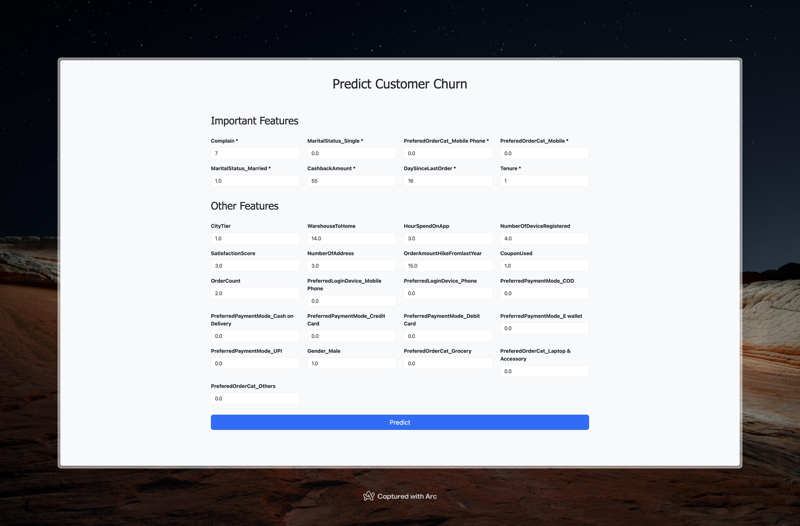

# Customer Churn Prediction

Customer churn prediction is a common challenge for many companies. It is crucial for businesses to identify customers who are likely to churn so they can take proactive measures to retain them. Additionally, understanding the factors that contribute to churn is beneficial for improving customer satisfaction. 

In this project, we use machine learning models to predict customer churn based on a telecommunication company data.

## App Demo

Inputting costumer data:



Predictions:


## Data

The dataset used in this project is sourced from a telecommunication company and contains 5630 rows and 20 columns. The dataset is available in the `data` folder and can also be downloaded from [Kaggle](https://www.kaggle.com/datasets/ankitverma2010/ecommerce-customer-churn-analysis-and-prediction).

## Usage

To run the project, first clone the repository:

```bash
git clone https://github.com/SepehrAkbari/stop-the-churn
cd stop-the-churn
```

Install the required libraries:

```bash
pip install -r requirements.txt
```

To explore the analysis, run the Jupyter Notebook located in the `notebook` folder:

```bash
jupyter notebook notebooks/stop-the-churn.ipynb
```

To launch the Flask app:

```bash
cd app
flask run
```

## Approach

- **Data Preprocessing:** 

  - Filtered irrelevant columns, encoded categorical variables, and imputed missing values (numeric values with mean imputation and categorical values using a Random Forest Regressor). 

  - One-hot encoding was performed, and the data was resampled using SMOTE to address class imbalance.

- **Exploratory Data Analysis:** 

  - Explored the distribution of the dataset’s features and analyzed their correlation with the target variable (Churn). 

  - Notably, features such as customer complaints exhibited a high positive correlation, while tenure showed a strong negative correlation with churn.

- **Model Comparison:** 

  - Discussed the limitations of using linear regression for this problem, and compared models including Logistic Regression, K-Nearest Neighbors (with three distance metrics), Linear and Kernel SVM, Random Forest, and boosting models (Gradient Boosting, XGBoost, and CatBoost). 

  - Models were evaluated using metrics like MSE, R-squared, accuracy, precision, recall, and F1 score. 

  - The XGBoost model was selected as the best performing model, achieving an F1 score of 94%.

- **Deployment:** 

  - The XGBoost model is deployed via a Flask web app, allowing administrators to input customer data and receive real-time churn predictions.

## Contributing

To contribute to this project, you can fork this repository and create pull requests. You can also open an issue if you find a bug or wish to make a suggestion.

## License

This project is licensed under the [GNU General Public License (GPL)](/LICENSE).
